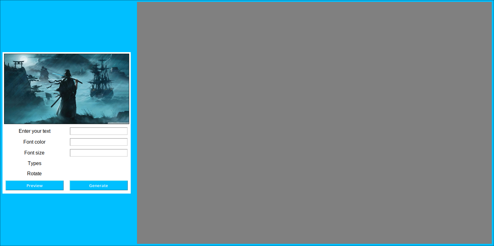

# Image Watermark

## What are we going to use: 
- pillow library(a fork of PIL, to work with images)
- tkinter(to make our gui)

## Planning out 

### Number of features to be implemented

- It should be able to take text input from the user.
- Ability to change font style, size and color of the added text.
- Tiling of the text: 
  - Single
  - Multiple horizontally or 
  - rotated at an angle
- Opacity

### Features which may be considered for future updates

- Showing actual preview of what is selected.
- improving the gui of application.
- adding a default watermark feature.

### Basic layout

